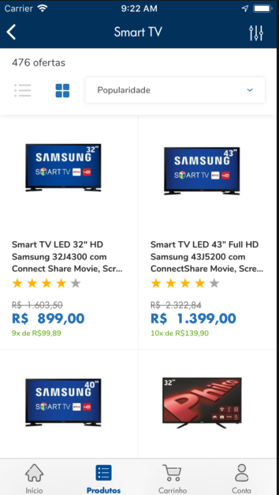
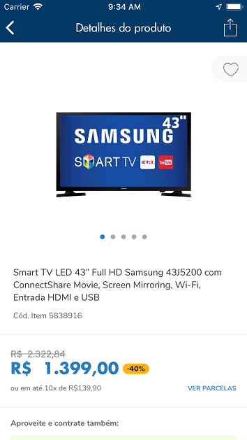
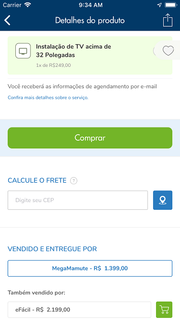
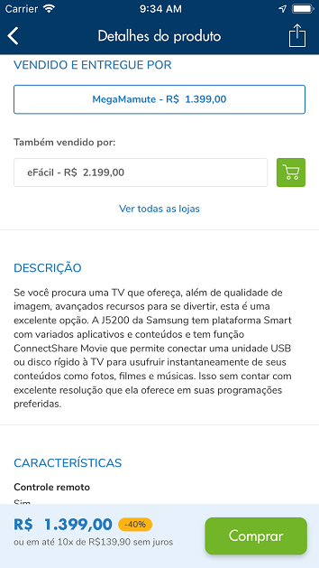
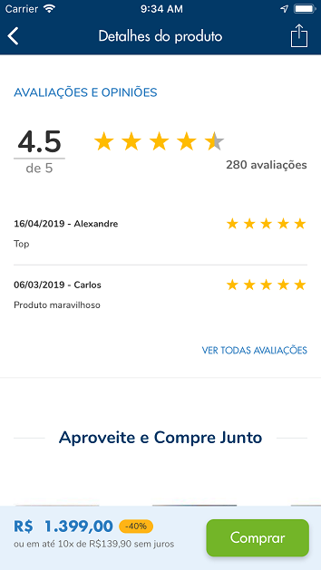
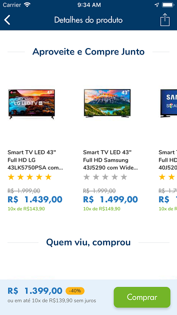

# Desafio Desenvolvedor iOS

----
Este desafio foi criado para avaliar os candidatos as vagas de iOS

O desafio
Criar um aplicativo que contenha uma tela de listagem de produtos e uma de detalhe do produto.

QuemViuComprou

## Requisitos

* Utilizar os mocks disponibilizados no Mocky IO para popular as telas de listagem de produtos e detalhe de produto.
* Considerar as flags e atributos disponibilizados no response de cada mock a fim de determinar exibição do depatarmento, ordenação, variação de preços e avaliações.

## Sobre o layout

A estrutura apresentada como modelo deve ser considerada apenas como referência. Não é obrigatório seguir a mesma minuciosamente, mas vale considerar a sua estrutura.

## O que será avaliado

* Componentização
* Código semãntico, limpo e claro
* Conhecimento de Swift orientado a objeto e protocolos
* Utilização do git com git flow
* Testes unitários
* A experiência do usuário deve ser a melhor possível

## Diferenciais

* Clean code
* MVC+Coordinator
* Código bem documentado
* TDD
* Linting

## Mocky IO

* Listagem de Produtos: [http://www.mocky.io/v2/5d1b4f0f34000074000006dd]

Detalhe do Produto:

* Avaliações: http://www.mocky.io/v2/5d1b4f9134000078000006e0
* Detalhe do produto: http://www.mocky.io/v2/5d1b4fd23400004c000006e1
* Quem viu, viu também: http://www.mocky.io/v2/5d1b50063400000f000006e7
* Aproveite e compre junto: http://www.mocky.io/v2/5d1b505134000074000006ec
* Quem viu comprou: http://www.mocky.io/v2/5d1b507634000054000006ed

## Observações

* Criar uma documentação em markdown (Readme) explicando como as aplicações devem ser executadas, quais os pre-requisitos para a mesma
* No final do Readme criar uma sessão chamada **Resultado** e descrever todos os príncipais desafios, linhas de raciocínio e tempo gasto para execução do teste. (Sim, presamos por uma explicação clara e objetiva)
# APP-Loja
